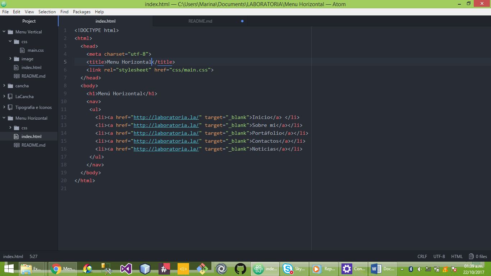
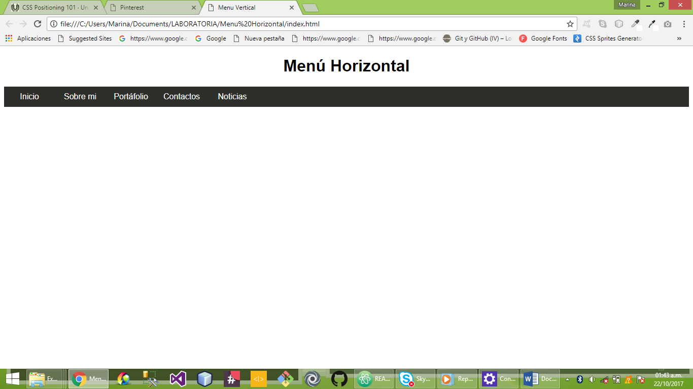

# MENÚ horizontal

En este trabajo podras encontrar información para realizar un menú desplegable pero de forma horizontal.

**EN NUESTRO ARCHIVO HTML TENDREMOS**

LA ESTRUCTURA DE NUESTRO MENÚ CON NUESTRAS LISTAS.

**EN NUESTRO ARCHIVO CSS TENDREMOS**

TODAS LOS ESTILOS ASIGNADOS A CADA LISTA UTILIZANDO LOS SELECTORES COMO:

 **HOVER** PARA CREAR UN EFECTO SOBRE EL LINK.
 **ACTIVE** CAMBIAR LOS EFECTOS AL HACER CLICK SOBRE CADA LINK.

 PARA TENER UN DISEÑO HORIZONTAL UTILIZAMOS:
 >display: inline-block

 O TAMBIEN PODEMOS UTLIZAR:
 >float:left

NUESTRO PRODUCTO FINAL SERA EL SIGUIENTE :

